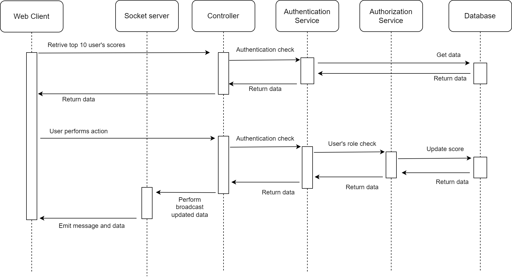

# Scoreboard Management Design

This document details the design for the "Scoreboard Management" within the API service. This module is responsible for handling user's score and maintaining a live-updated scoreboard displaying the top 10 users.

## Functionality:
- Receive, validate and update score from user's requests.
- Authenticate and authorize user.
- Broadcast updated scoreboard data to connected users in real-time.

# Create a diagram to illustrate the flow of execution. 

## Flow of Execution:
1. **User Action**: A user performs an action on the website that will dispatch an API call to the application server to update the score.
2. **API Request**: The user sends an API request to the `/score` endpoint on the API service with relevant data, including user access token.
3. **Authentication**: The server will receive the data from the request. Based on the access token, the decoded data will be verified then authorize if success.
3. **Authorization**: Based on the authorization data received in the previous step, the API service verifies the user's authorization to update the score.
4. **Score Update**: If authorized, the service will update the user's score in the database.
5. **Real-time Update**: The server broadcasts the updated scoreboard data to all connected clients via a Socket connection.
6. **User Update**: User receive the updated scoreboard data and dynamically update the displayed scoreboard on the website.

# Additional comments
- Instead of using WebSocket for real-time updates, consider implementing long polling. This approach can optimize server resources and simplify the implementation by avoiding the complexities associated with WebSocket. However, we should ensure that the polling interval is chosen carefully to balance between real-time updates and server load.
- Consider implementing debounce functionality to mitigate excessive API calls triggered by rapid user actions.
- Consider implementing rate limiting on API requests

## Requirements Documentation:
1. **Functional Requirements**:
   - Retrieve Top 10 User Scores
   - Real-Time Scoreboard Update
   - Authentication and authorization
   
2. **Non-functional Requirements**:
   - The system should handle requests and responses efficiently to ensure a responsive user experience.
   - The system should be able to scale to support a large number of concurrent users and requests.
   - The system should ensure the security of user data and prevent unauthorized access.
   - The system should be maintainable and easy to update.